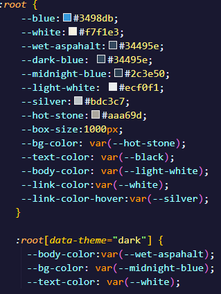
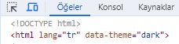
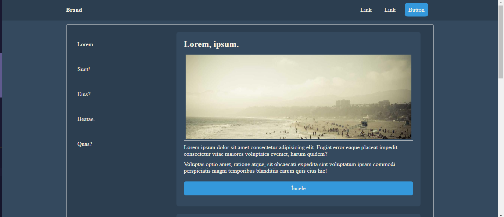
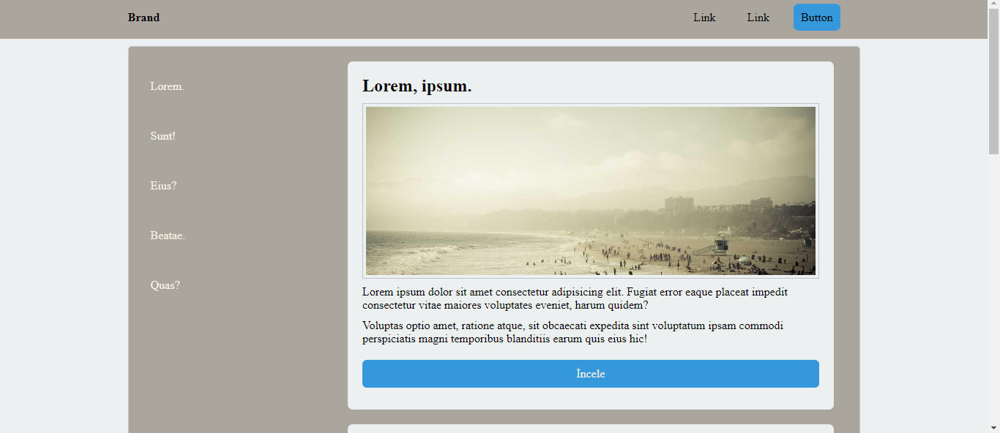

# CSS-Pico-Clone

Bu projemde HTML ve CSS kullanarak clone çalışması yaptım.

CSS yazarken root kullanımını anlamaya ve kullanmaya özen gösterdim.

Root kullanarak sayfada kullanılacak renk temalarını önceden belirledim. Bunu yapmam CSS kodlarını daha hızlı yazmama yardımcı oldu.

Root kullanarak farklı temalarda da çalışılabileceğini gördüm.

Bu projede light ve dark olmak üzere iki tane tema kullanılmıştır. Sayfa dark tema üzerinden oluşturuldu. Light temasına bakmak için mause üzeirinden sağ tuşa basıp inceleyi seçiniz.
Bunu yaptıktan sonra aşağıdaki görselde dark yazan yere light yazıp enter tuşuna basmanız yeterli olacaktır. Sayfayı eski haline çevirmek içinde sayfayı yenilemeniz yeterli olacaktır.

<b>Projenin canlı haline bakmak için [buraya tıklayınız.](https://aliberkaycelik-css-pico-clone.netlify.app/)

### Dark Tema:

### Light Tema:

